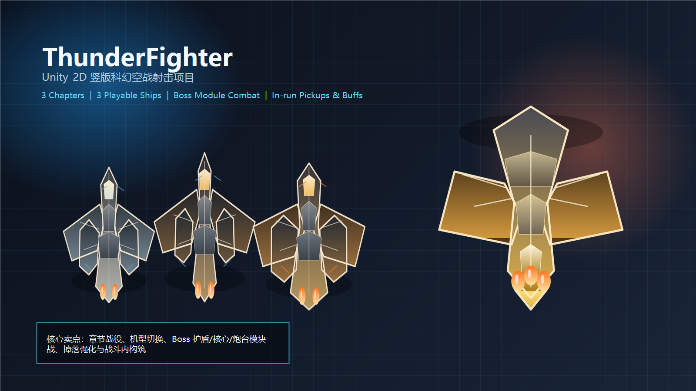
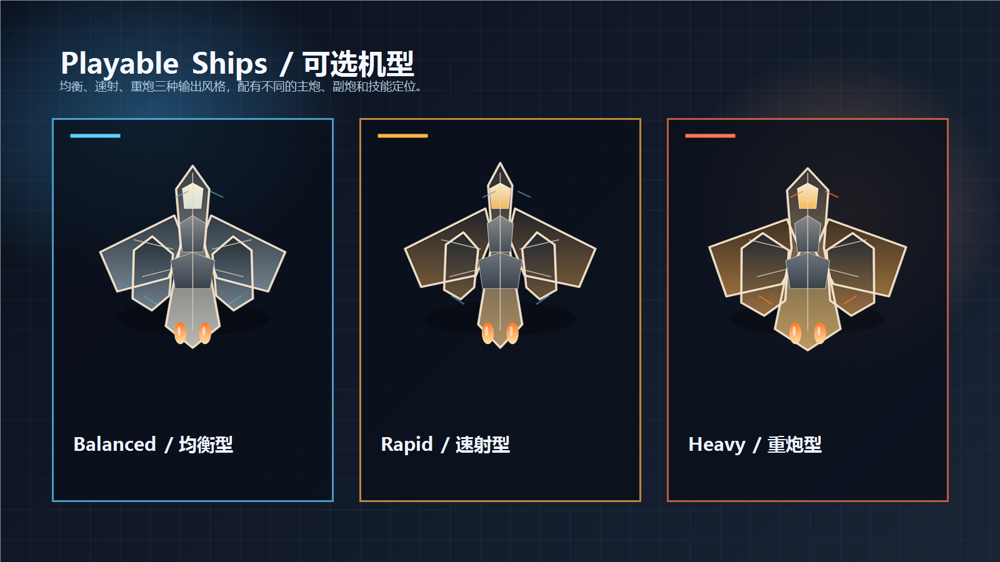
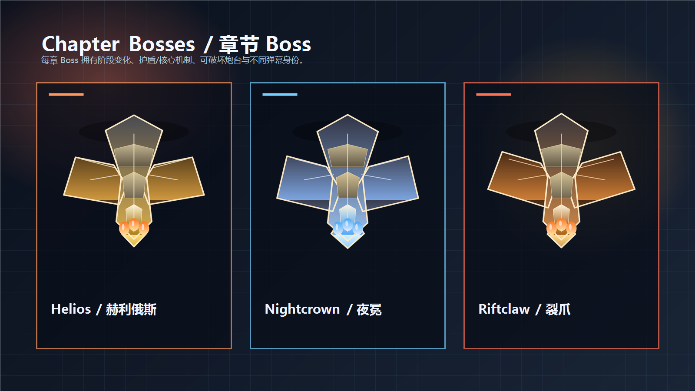
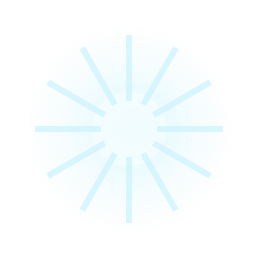
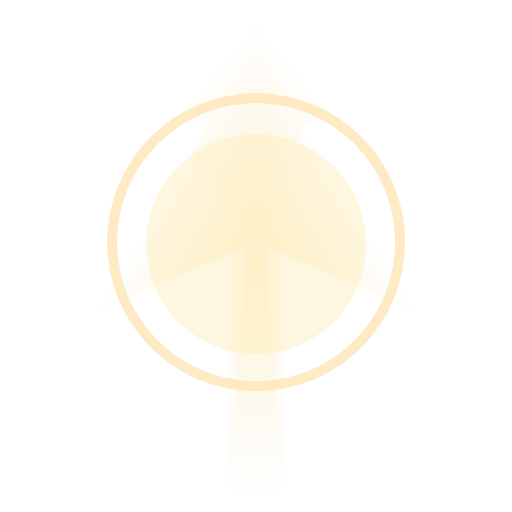

# ThunderFighter Unity

> 一个基于 Unity 2D 制作的竖版科幻空战射击项目。当前版本已经具备三章节战役、三台可选机型、Boss 多阶段机制、局内掉落强化、中文界面与完整菜单流程。

<p align="center">
  
</p>

## 项目亮点

- 三章节战役流程：`MainMenu -> ChapterSelect -> Level_01 ~ Level_03 -> Result`
- 三台可选玩家机型：`均衡型 / 速射型 / 重炮型`
- 多阶段 Boss 战：护盾、核心、炮台模块、阶段切换、锁定激光、蓄力反击
- 局内掉落与临时强化：火力升级、技能能量、攻速/伤害/磁吸/减伤等 Buff
- 完整中文 UI：主菜单、作战部署、HUD、结算页、设置页
- 科幻终端风 UI：章节选择、战术提示、Boss 警报、技能条、模块状态提示

## 项目预览

### 机型展示
<p align="center">
  
</p>

### Boss 展示
<p align="center">
  
</p>

### 技能特效
<p align="center">
  
  
</p>

## 当前可玩内容

### 章节与战役
- `Level_01`：近地轨道拦截
- `Level_02`：陨石带突入
- `Level_03`：深空旗舰战

### 玩家机型
- `均衡型`：稳定火力、多列覆盖、综合性能均衡
- `速射型`：高射速压制、更强清场与持续输出
- `重炮型`：高单发、强破盾、擅长打模块和弱点

### 战斗系统
- 玩家主炮 / 副炮 / 冲刺 / 双技能系统
- 局内掉落强化与临时 Buff
- 精英敌机、包抄机、俯冲机、支援型敌机协同压迫
- Boss 护盾、核心暴露、可破坏炮台、替代攻击模式
- 命中反馈分层：普通敌机、精英、支援机、Boss 护盾、炮台、核心

## 操作说明

| 操作 | 键位 |
|---|---|
| 移动 | `WASD` / `方向键` |
| 开火 | `J` / `鼠标左键` |
| 冲刺 / 闪避 | `Space` |
| 技能 1 | `K` |
| 技能 2 | `L` |
| 暂停 | `Esc` |

## 如何运行

### 环境要求
- Unity 6（项目当前使用 Unity 6000 系列进行开发）
- Windows

### 启动步骤
1. 使用 Unity Hub 打开项目目录 `ThunderFighterUnity`
2. 等待项目导入完成
3. 打开场景：`Assets/Scenes/MainMenu.unity`
4. 点击 `Play` 开始游戏

### 推荐测试流程
1. 在主菜单进入 `作战部署`
2. 选择章节与机型
3. 进入战斗后测试：掉落、火力升级、技能、Boss 阶段切换
4. 通关后查看结算页与章节解锁反馈

## 项目结构

```text
Assets/
├─ Scenes/                 主菜单、部署页、三章节、结算页
├─ Scripts/
│  ├─ Core/                流程、事件、存档、章节系统、掉落分发
│  ├─ Player/              玩家机体、技能、Buff、机型装配
│  ├─ Combat/              武器、子弹、命中反馈、掉落物
│  ├─ Enemy/               敌机行为、协同与特殊职责
│  ├─ Boss/                Boss 阶段、模块、攻击模式
│  ├─ UI/                  主菜单、HUD、部署页、结算页、设置页
│  └─ Config/              ScriptableObject 配置
└─ Resources/GeneratedArt/ 运行时与展示用生成素材
```

## 仓库展示说明

- `docs/media/cover.png`：仓库首页封面图
- `docs/media/ships.png`：三台玩家机型展示
- `docs/media/bosses.png`：三章节 Boss 展示
- `docs/media/skill-*.png`：技能特效预览

> 当前仓库展示图主要来自项目内实际使用的机体与技能素材，用于快速展示项目风格与系统结构。

## 开发状态

当前项目已经从早期 MVP 推进到“可完整演示”的阶段，重点完成了：
- 三章节战役主链
- 机型选择与升级系统
- Boss 多阶段机制
- 局内掉落与强化
- 中文 UI 与设置页

后续仍可继续优化：
- 更高质量的实机战斗截图 / GIF
- 更多敌机职责与 Boss 模块
- 更完整的音效与演出包装
- 更统一的美术风格收束

## License

当前仓库未单独声明开源许可证。如需公开协作，建议补充 `LICENSE` 文件。
